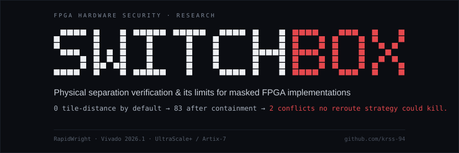
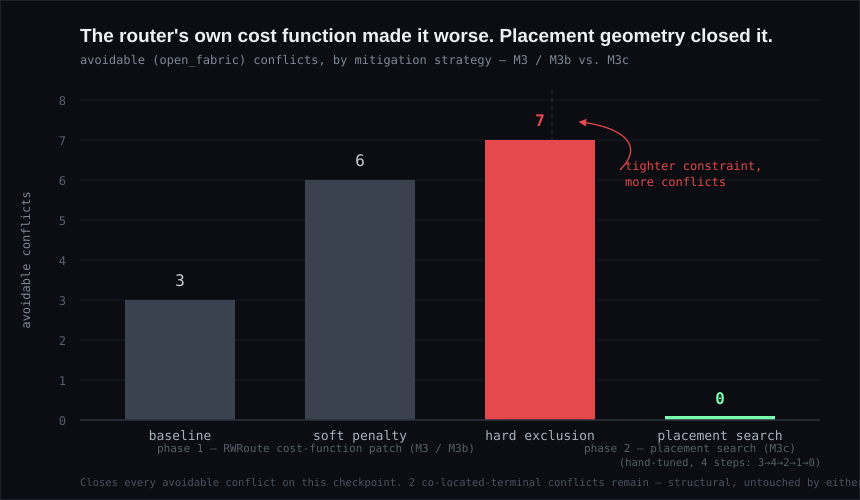
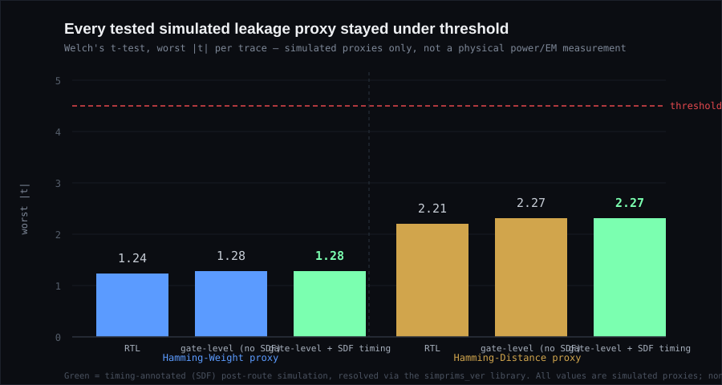
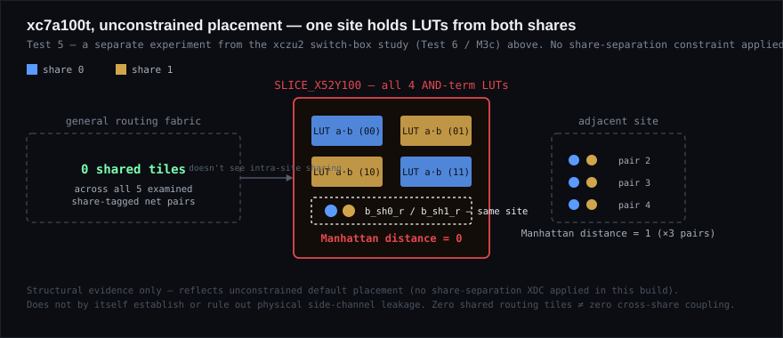

<div align="center">



<br/>


<br/>

### *How far can a commercial FPGA toolchain be pushed to respect the physical isolation that masked cryptographic hardware depends on — and where, precisely, does it stop listening?*

<br/>


-0a0e17?style=for-the-badge&labelColor=0a0e17&color=7cffcb)


</div>

<br/>

> **TL;DR** — Pblock containment fixes *where cells sit*, not *how nets route*. On a from-scratch 2-share AND gadget, three independently-built automated rerouting strategies — including a patched RapidWright router — all failed to eliminate cross-share switch-box conflicts, and tightening the router's own cost function made things *worse*, not better. A follow-on hand-tuned placement-geometry search (M3c) later closed every *avoidable* conflict, leaving **2 conflicts confirmed structurally unavoidable** on this device — by two independent methods. Separately, a full security test suite (exhaustive functional correctness, Hamming-Weight and Hamming-Distance TVLA proxies, and now-resolved SDF timing-annotated TVLA) found no detectable leakage in any tested simulated proxy — but **no physical power/EM measurement was ever performed**, a structural placement analysis on the active xc7a100t build found both shares' logic co-located in the same site under the current unconstrained placement, and the project's broader second-order/joint leakage security remains **not established** (the fixed-vs-random TVLA construction itself is structurally confounded for same-variable share pairs, not merely awaiting a stimulus tweak). A follow-on **Constraint Repair v1** experiment found the residual xc7a100t co-location was an avoidable XDC coverage gap rather than a structural one, and closed it with no additional LUT count and no further timing cost beyond the 0.062 ns WNS reduction separation already paid — a single-instance result, not a demonstrated general fix.

<br/>

This repository holds the code, constraints, and evidence for an empirical study of masked-share physical separation on Xilinx/AMD FPGAs, built on [RapidWright](https://github.com/Xilinx/RapidWright) and Vivado. It combines a novel switch-box-level conflict detector, three independent automated rerouting attempts, a source-level patch to RapidWright's own router, a hand-tuned placement-geometry follow-on, and a full security test suite spanning exhaustive functional verification, simulated statistical leakage proxies (including timing-annotated SDF simulation), and structural placement/routing analysis — arriving at a reproducible negative result on the toolchain side, and a set of scoped, non-overclaiming findings on the security side:

<div align="center">

> **No automated, tool-level path in Vivado or RapidWright currently guarantees that routing respects masked-share isolation — and forcing avoidance of specific tiles relocates risk rather than eliminating it. Even a hand-tuned placement search that closes every avoidable conflict still leaves conflicts that are structural, not incidental.**

</div>

<br/>

<details>
<summary><b>📖 Contents</b></summary>

- [The concept, in real time](#the-concept-in-real-time)
- [Results at a glance](#results-at-a-glance)
- [Security test suite (TEST 1–8)](#security-test-suite-test-1-8)
- [Pipeline](#pipeline)
- [Why this exists](#why-this-exists)
- [How this compares to prior work](#how-this-compares-to-prior-work)
- [Repository structure](#repository-structure)
- [Reproducing this work](#reproducing-this-work)
- [Disclosed limitations](#disclosed-limitations)
- [Provenance and known gaps](#provenance-and-known-gaps)
- [Citation](#citation)

</details>

<br/>

## The concept, in real time

Pblock containment fixes *placement*. Nothing downstream stops the router from threading both shares' nets through the same switch-box on the way to their sinks — which is exactly the failure this project measures.

<div align="center">

</div>

<br/>

## Results at a glance

<div align="center">

| Milestone | What it tested | Result |
|:---|:---|:---|
| **M0 — Baseline separation** | Does default Vivado placement keep shares apart? | **0** tile-distance out of the box. Hard pblock containment (`IS_SOFT false`, no `CONTAIN_ROUTING`) fixes it — **min tile-distance 83**, 0 routing errors, byte-for-byte reproducible. |
| **M1 — Conflict detection** *(novel)* | Is distance alone sufficient? | No. A custom RapidWright switch-box scanner finds **28 cross-share conflicts**, collapsing to **2 physical tiles**, in **under 3 seconds**. |
| **M2 / M2b — Automated rerouting** *(negative result)* | Can the router be told to avoid them? | Three independent attempts — default reroute, `-directive Explore`, and a custom weighted-A\* pathfinder on the raw PIP graph — all fail. **0 / 9 nets** successfully rerouted. |
| **M3 / M3b — Custom RWRoute cost function** *(negative result, root-caused)* | Can the router's own cost function be patched to comply? | Patched RWRoute internals (soft penalty → hard exclusion) on UltraScale+. Genuinely avoidable conflicts get **worse**, not better, as the constraint tightens (3 → 6 → 7). Two conflicts are confirmed, by two independent methods, structurally unavoidable. |
| **M3c — Placement-geometry search** *(follow-on, hand-tuned)* | Can changing *where cells sit*, rather than the router's cost function, close the avoidable conflicts? | A four-step, manually root-caused placement search drove the avoidable (`open_fabric`) conflict count **3 → 4 → 2 → 1 → 0**. The remaining **2 conflicts are `co_located_terminal` type** — the shared tile is a physical source/sink for both nets by the gadget's own designed structure, not a routing or placement choice. Confirms M3/M3b's unavoidable pair by a second, independent method. |
| **M4 — Leakage evaluation (TVLA)** *(separate device/lineage)* | Does a conventionally-synthesized build leak under a statistical (Welch's t-test) leakage proxy? | On Artix-7 (v2 RTL lineage — not derived from the M0–M3c checkpoint): Hamming-Weight max \|t\| = **1.240** RTL / **1.280** gate-level; Hamming-Distance max \|t\| = **2.210** RTL / **2.270** gate-level; all under the 4.5 threshold. Timing-annotated (SDF) simulation is **now resolved** (see Security test suite below) — HW max \|t\| = **1.280**, HD max \|t\| = **2.270**. **No physical power/EM measurement was performed.** |

</div>

<div align="center">

<br/>
<sub>Tightening the RWRoute constraint made it <i>worse</i>, not better — the central, counterintuitive finding of M3/M3b. A separate, hand-tuned placement search (M3c) later closed every avoidable conflict; the 2 structural ones were untouched by either approach. (Per-stage conflict counts for M3/M3b were not separately saved as CSVs; the 3 → 6 → 7 figures are taken from the project's own run history, not independently re-derived during this audit — see <a href="docs/PROVENANCE_GAPS.md">docs/PROVENANCE_GAPS.md</a>. The M3c figure is independently confirmed from its own saved <code>switchbox_conflict_report.json</code>.)</sub>
</div>

Full per-file provenance for every checkpoint and result: **[`results/INDEX.md`](results/INDEX.md)**. Full M3c methodology: **[`docs/M3C_PLACEMENT_GEOMETRY.md`](docs/M3C_PLACEMENT_GEOMETRY.md)**. Full M4/TVLA methodology: **[`docs/M4_TVLA_SUMMARY.md`](docs/M4_TVLA_SUMMARY.md)**.

<br/>

## Security test suite (TEST 1–8)

A separate, more complete security investigation was run against the active `xc7a100t` build (the same device/lineage as M4 above). It extends M4's TVLA work with exhaustive functional verification, a second leakage-proxy metric, second-order analysis, structural placement analysis, a resolved SDF-timing TVLA run, and a follow-on constraint-repair experiment. Every result below is one of four explicit categories — **VERIFIED**, **VERIFIED UNDER SIMULATION MODEL**, **STRUCTURAL EVIDENCE**, or **NOT ESTABLISHED** — and none of them establishes physical side-channel security.

<div align="center">

| Test | What it checked | Result | Classification |
|:---|:---|:---|:---:|
| **1 — Exhaustive functional correctness** | All 2⁵ = 32 combinations of `(a_sh0, a_sh1, b_sh0, b_sh1, r)` against `q_sh0 ^ q_sh1 == (a_sh0^a_sh1) & (b_sh0^b_sh1)` | **32 / 32 pass, 0 errors** | VERIFIED (RTL simulation) |
| **2 — Share-reconstruction invariant** | Reconstruction correctness across the same 32 combinations | Correct for all 32 | VERIFIED (RTL simulation) |
| **3 — Hamming-Weight TVLA proxy** | Welch's t-test, 20,000 fixed / 20,000 random traces | Worst \|t\| = **1.240** (RTL) / **1.280** (gate-level, no SDF); signal `a_sh0_r`. Threshold 4.5 — not exceeded | VERIFIED UNDER SIMULATION MODEL |
| **3b — Hamming-Distance TVLA proxy** | Cycle-to-cycle toggle activity, same trace populations | Worst \|t\| = **2.210** (RTL) / **2.270** (gate-level, no SDF); signal `a_sh0_r`. Threshold 4.5 — not exceeded | VERIFIED UNDER SIMULATION MODEL |
| **4 — Second-order / joint-share analysis** | Joint leakage across signal pairs, fixed-vs-random TVLA | Two independent fixed-population stimulus constructions were tried. Both are **structurally confounded** for same-variable share pairs (`a_sh0_r`/`a_sh1_r`, `b_sh0_r`/`b_sh1_r`): fixing the secret makes the two shares deterministically related, so the masking invariant itself gets encoded in the population label, producing large pairwise \|t\| values that are not interpretable as leakage. Changing the fixed value changes the confound's shape, not its root cause. Tested *non-tautological* cross-variable pairs show no detectable joint leakage under the current stimulus/model | Tested subset: VERIFIED UNDER SIMULATION MODEL · same-variable pairs: **NOT ESTABLISHED / methodology requires redesign** |
| **5 — xc7a100t structural placement analysis** | Share-tagged register/LUT placement, Manhattan distance, routing-tile overlap, BEL/SITE co-location (unconstrained build — no share-separation XDC applied) | **0** shared general-fabric routing tiles across all 5 examined pairs, but `b_sh0_r`/`b_sh1_r` sit at Manhattan distance **0** (same site), the other 3 pairs at distance **1**, and `SLICE_X52Y100` co-packs all four AND-term LUTs from both shares. Zero shared routing tiles does **not** imply physical separation — a routing-tile diff cannot see intra-site sharing | STRUCTURAL EVIDENCE |
| **6 — xczu2 switchbox experiment** *(separate device/experiment — see M3c above)* | Cross-share switchbox conflicts after the M3c placement search | 2 events, both `co_located_terminal`; `open_fabric_count = 0` | STRUCTURAL EVIDENCE |
| **7 — SDF post-route timing simulation** | Full 40,000-cycle TVLA run against the real post-route netlist with SDF timing delays annotated (`simprims_ver` library resolved the earlier blocker) | HW worst \|t\| = **1.280**, HD worst \|t\| = **2.270**, signal `a_sh0_r` in both. Threshold 4.5 — not exceeded | VERIFIED UNDER SIMULATION MODEL |
| **8 — Constraint Repair v1** *(follow-on to Test 5, same xc7a100t lineage)* | Baseline → original share-separation XDC → repaired XDC, cross-share term-LUT placement coverage | Baseline: 0-tile register distance, `cross01`/`cross10` co-located with mixed-share cells in `SLICE_X52Y100`. Original XDC: 29-tile register distance, but `cross10` fell outside the naming-based pblock selector and was orphaned at `SLICE_X59Y99`. Repaired XDC: 29-tile register distance, both cross-share term LUTs correctly pinned, **0** cross-share shared routing tiles, **0** cross-share mixing in any examined site, **10 LUTs in all three builds (no overhead)**, WNS 5.501 ns (unchanged from original XDC), fully routed, 0 routing errors, 1 unrelated `CFGBVS-1` DRC warning | STRUCTURAL EVIDENCE |

</div>

<div align="center">

</div>

<div align="center">

</div>

**Tests 5 and 6 are not the same implementation and are not combined.** Test 5 is the active `xc7a100t` (Artix-7) build with no share-separation placement constraint applied; Test 6 is the separate `xczu2` (UltraScale+) experiment from M3/M3b/M3c, which *does* use hard pblock containment. A routing-tile diff structurally cannot see intra-site sharing (site PIPs, LUT fracturing, shared control sets), which is why Test 5 shows both "0 shared routing tiles" and same-site co-location at once — the two facts describe different mechanisms, not a contradiction.

### Constraint Repair v1

A follow-on experiment on the same `xc7a100t` lineage as Test 5 investigated whether the co-location Test 5 found was avoidable. `share_separation.xdc` selects cells by a `*_sh0*` / `*_sh1*` instance-name pattern; the cross-share product-term LUTs (`u_and_cross01`, `u_and_cross10`) — the structures the RTL's own header comment flags as highest-risk — aren't named with either suffix, so the original constraint had no basis to place them.

<div align="center">

| Metric | Baseline (no constraint) | v1 (original XDC) | v2 (repaired XDC) |
|:---|:---:|:---:|:---:|
| Share-0/share-1 register min. distance | 0 tiles | 29 tiles | 29 tiles |
| Cross-share term LUT coverage | Both `cross01`/`cross10` co-located with mixed-share cells in `SLICE_X52Y100` | `cross01` incidentally share-1-side; **`cross10` unpinned, orphaned at `SLICE_X59Y99`, outside both pblocks** | **Both `cross01`/`cross10` correctly pinned, one pblock each — zero cross-share mixing in any site** |
| Cross-share shared routing tiles | not separately tested | not separately tested | **0** |
| LUTs | 10 | 10 | 10 — no overhead |
| WNS | 5.563 ns | 5.501 ns | 5.501 ns — unchanged from v1 |
| Route status | 0 errors | 0 errors | 0 errors |
| DRC | not run | not run | 1 warning (`CFGBVS-1` — generic OOC I/O-bank config warning, unrelated to placement/separation, not a violation) |

</div>

**Result:** the `cross10` orphan identified in v1 was an **avoidable constraint-coverage gap, not a structural conflict** — expanding the XDC's cell-selection pattern to explicitly match `*cross01*`/`*cross10*` closed it fully, at zero additional LUT cost (10 LUTs in all three builds) and no timing cost beyond what separation already paid in v1 (a real 0.062 ns WNS reduction from baseline, present in both v1 and v2, with 0 failing endpoints in all three builds). Fully routed, 0 routing errors, 1 unrelated DRC warning.

This is a completed, hand-verified, **single-instance** repair: it demonstrates that at least one residual cross-share conflict on this build was avoidable and that the constraint-selection mechanism itself can be fixed — it does not demonstrate general or automated mitigation. Generalizing this hand-run repair into an automated scanner → classifier → constraint-generator → reroute → rescan loop (**M5**) is scoped as future work and has not been started. The stronger research contribution of this project remains the combination of switch-box-level conflict detection, the failed automated rerouting attempts, the root-caused router limitations, the M3c placement-geometry search, the identified structurally-unavoidable conflicts, and the separate security/structural evaluation above — Constraint Repair v1 is an additional, concrete finding within that, not a reframing of it.

### Project status

- Physical conflict detection (M1, xczu2 switch-box scan): **COMPLETE**.
- Constraint Repair v1 (xc7a100t cross-term XDC coverage repair): **COMPLETE**.
- M5 — automated scanner → classifier → constraint-generator → reroute → rescan loop: **NOT STARTED**.
- Multi-gadget / multi-design generalization: **NOT STARTED**.

### Current security status

**Established / verified**
1. Exhaustive RTL functional correctness, 32 / 32.
2. RTL share-reconstruction invariant, all 32 combinations.
3. No detectable first-order Hamming-Weight leakage in the tested simulated RTL and gate-level traces.
4. No detectable Hamming-Distance leakage in the tested simulated RTL and gate-level traces.
5. SDF timing-annotated gate-level TVLA completed successfully — HW worst \|t\| = 1.280, HD worst \|t\| = 2.270.
6. Tested non-tautological cross-variable joint signal pairs show no detectable leakage under the current simulated model, scoped strictly to the tested subset.

**Structural evidence**
7. Zero shared general-fabric routing tiles in the current, *unconstrained* `xc7a100t` implementation (Test 5) — this does not by itself establish separation; see below.
8. Separate `xczu2` experiment: zero open-fabric switchbox conflicts, two co-located-terminal events (M3c).
9. **Constraint Repair v1**: on a separately, explicitly constrained `xc7a100t` build, the cross-share term-LUT co-location Test 5 found was traced to an avoidable XDC coverage gap and closed — zero cross-share site/routing-tile mixing in the repaired build, no additional LUT count, and no timing cost beyond the 0.062 ns WNS reduction separation already paid. Single-instance, hand-verified; not a general or automated result.

**Not established**
- Physical power/EM side-channel security.
- Same-variable second-order/joint leakage evaluation: **NOT ESTABLISHED / methodology requires redesign** — two independent fixed-population TVLA stimulus constructions were tried, and both are structurally confounded for same-variable share pairs (the masking invariant itself gets encoded in the population label). This is not a pending parameter tweak; it requires a different experimental design, such as a properly constructed higher-order CPA using randomized rather than fixed-population traces.
- Strong share separation in the *unconstrained* `xc7a100t` build characterized by Test 5 — that specific build has no share-separation constraint applied. (A separately constrained build, Constraint Repair v1, does achieve zero cross-share site/routing-tile mixing for the examined pairs, but that is a single-instance, hand-verified result — not a generalized or automated guarantee, and not a claim about Test 5's build.)
- General or automated detection/repair of constraint-coverage gaps — Constraint Repair v1 fixed one identified gap by hand; the scanner → classifier → constraint-generator → reroute → rescan loop (M5) has not been built.
- Physical silicon behavior of any kind.

None of the above should be read as "secure," "leak-free," or "side-channel resistant" — those terms are deliberately not used anywhere in this repository. Every result is a specific, scoped statement about a specific simulated model or structural artifact.

**The defined simulation and structural-verification scope is complete. Physical power/EM measurement and genuine higher-order leakage evaluation remain outside the current experimental scope.**

### Next steps

**Completed**
- Manual, single-instance share-separation experiment (`xc7a100t`, Test 5).
- Constraint Repair v1 — cross-term XDC coverage repair.
- SDF timing-annotated gate-level TVLA (Test 7).
- Second-order TVLA methodology investigation (Test 4).

**Remaining**
1. Automated M5 scanner → classifier → XDC-generator → reroute → rescan loop.
2. Multi-gadget / generalization study beyond this single 2-share AND gadget.
3. A genuine higher-order (e.g. second-order CPA) evaluation methodology that doesn't depend on a fixed-population TVLA construction.
4. Physical power/EM measurement — no result in this repository substitutes for it.
5. xczu2 M1 → M3c gate-level comparison, if still applicable to the current checkpoint lineage.
6. `tb_masked_and_gadget.v` rename/checker fix, if it remains unapplied.

<br/>

## Pipeline

```mermaid
flowchart LR
    A[M0<br/>Baseline placement] -->|0 tile-distance| B[M0<br/>Hard pblock containment]
    B -->|min distance 83| C[M1<br/>Switch-box conflict scan]
    C -->|28 conflicts → 2 tiles| D[M2 / M2b<br/>Automated reroute attempts]
    D -->|0 / 9 nets rerouted| E[M3<br/>RWRoute soft-penalty patch]
    E -->|conflicts increase| F[M3b<br/>RWRoute hard-exclusion patch]
    F -->|2 conflicts structurally unavoidable| G[M3c<br/>Placement-geometry search]
    G -->|open_fabric 3→0, 2 co-located remain| H[Result:<br/>no tool-level guarantee]
    H -.->|separate device / lineage| I[M4 / TEST1-4<br/>Functional + TVLA proxies]
    I -.->|HW 1.24-1.28, HD 2.21-2.27, below 4.5| J[TEST7<br/>SDF-annotated TVLA: resolved]
    I -.->|unconstrained placement| K[TEST5<br/>xc7a100t co-location, structural]
    K -.->|coverage gap found, then repaired| L[TEST8<br/>Constraint Repair v1: closed]

    style A fill:#0a0e17,stroke:#00e5ff,color:#eafcff
    style B fill:#0a0e17,stroke:#00e5ff,color:#eafcff
    style C fill:#0a0e17,stroke:#7cffcb,color:#eafcff
    style D fill:#0a0e17,stroke:#ff9b3b,color:#eafcff
    style E fill:#0a0e17,stroke:#ff9b3b,color:#eafcff
    style F fill:#0a0e17,stroke:#ff4fd8,color:#eafcff
    style G fill:#0a0e17,stroke:#ff4fd8,color:#eafcff
    style H fill:#3a0d14,stroke:#ff3b3b,color:#ffdada
    style I fill:#0a0e17,stroke:#7cffcb,color:#eafcff
    style J fill:#0a1f14,stroke:#7bffb0,color:#daffe9
    style K fill:#241a05,stroke:#ffb648,color:#ffe9c2
    style L fill:#0a1f14,stroke:#7bffb0,color:#daffe9
```



<br/>

## Why this exists

Masking splits a secret into randomized shares so no single share reveals information about it — but that guarantee only holds if the shares stay physically isolated all the way through synthesis, placement, and routing. Commercial FPGA toolchains have no concept of a "share boundary" and can silently reintroduce the correlated leakage masking was meant to eliminate. A pblock report that says "isolated" is a placement report, not a routing guarantee — and this repo is the evidence for that gap.

<br/>

## How this compares to prior work

<div align="center">

| | **US Patent 12,307,000** | **Müller, Lammers, Osterheider, Moradi** — *"Coupling Leakage in Theory and Practice"* (IACR ePrint 2026/1426, TCHES 2026) | **This project** |
|:---|:---:|:---:|:---:|
| Target | ASIC / GDSII | FPGA (Vivado + RapidWright + Pblocks) | FPGA (Vivado + RapidWright + Pblocks) |
| Design scale | — | AES S-box | 2-share AND gadget (from scratch) |
| Conflict resolution | Minimum-distance design rules | **Manual** | **Automated attempts, quantified and root-caused; plus a hand-tuned placement-geometry follow-on** |
| Core contribution | Distance rules at layout level | Demonstrates the conflict exists | Measures *whether automation can fix it*, shows which conflicts a hand-tuned search still can't, and separately evaluates a simulated leakage proxy |

</div>

This project's contribution is narrower and more specific than "physical separation verification exists": it's a set of concrete, reproducible findings about the *limits* of automated mitigation once separation is attempted — developed independently, quantified across three escalating, independently-verified automated attempts, and checked against a hand-tuned placement search that establishes which conflicts are structural rather than merely unsolved.

<br/>

## Repository structure

<details>
<summary><b>Click to expand full tree</b></summary>

```
.
├── rtl/                              Verilog test gadgets (AND / XOR / NAND, v1 lineage) plus
│                                       masked_and_gadget_v2.v and TVLA testbenches (v2 lineage, M4)
├── constraints/                      XDC pblock constraints for each containment strategy
├── tcl/
│   ├── build_milestone0.tcl, ...     Vivado build & verification scripts (synth → place → route)
│   └── m4/                           M4 (Artix-7) pipeline: test2_synth.tcl → test5_export_gatelevel.tcl
├── src/
│   ├── m0_share_distance/            Tile-distance measurement between shares
│   ├── m0_coverage/                  Share-tagging coverage audit (naming-heuristic validation)
│   ├── m1_conflict_detection/        Switch-box/tile conflict detector (RapidWright, novel)
│   ├── m2b_targeted_reroute/         Custom weighted-A* pathfinder on the raw PIP graph
│   ├── m3b_rwroute_patch/            Patched RWRoute.java (hard-exclusion cost function)
│   ├── m3c_placement_geometry/       Placement-geometry search, v2 (regression) → v5 (open_fabric=0)
│   ├── m4_tvla/                      TVLA stimulus generation + Welch's t-test analysis (Hamming-Weight)
│   ├── ultrascale_gadget_build/      Minimal 4-net UltraScale+ gadget, built directly via
│   │                                  the RapidWright Python API (bypasses Series7 restriction)
│   └── utils/                        RapidWright API probes, device-load diagnostics
├── security_tests/                   TEST 1-8 security investigation + Constraint Repair v1, xc7a100t
│   ├── tb_functional_exhaustive.v    TEST 1/2 — exhaustive functional + share-reconstruction check
│   ├── tvla_hd_analysis.py           TEST 3b — Hamming-Distance TVLA proxy
│   ├── tvla_2nd_order_analysis.py    TEST 4 — second-order/joint-share TVLA (confound investigation)
│   ├── gen_tvla_stimulus_v2.py       TEST 4 — second stimulus construction tried
│   ├── stimulus_v2_fixed11.mem       TEST 4 — fixed-population trace input, v2 stimulus
│   ├── tb_tvla_v2_nondegenerate.v    TEST 4 — testbench, v2 stimulus
│   ├── tvla_trace_v2_nondegenerate.csv  TEST 4 — trace output, v2 stimulus
│   ├── tb_gatelevel_tvla_sdf.v       TEST 7 — SDF timing-annotated gate-level TVLA testbench
│   ├── gatelevel_tvla_sdf_run.log    TEST 7 — run log (PASS / SDF / $finish evidence)
│   ├── tvla_trace_gatelevel_sdf.csv  TEST 7 — trace output
│   ├── test3_place_route_separated.tcl      Constraint Repair v1 — place/route with the repaired XDC
│   ├── test3_place_route_separated_out/     Constraint Repair v1 — v2 build checkpoints + reports
│   ├── NOTE_experiment_lineage_separation.md   Note — keeps xc7a100t / xczu2 lineages explicitly separate
│   ├── NOTE_sdf_simprims_requirement.md        Note — the simprims_ver dependency behind TEST 7's earlier blocker
│   └── NOTE_tb_masked_and_gadget_scope.md      Note — scope/rename caveat on tb_masked_and_gadget.v
├── results/
│   ├── m0_baseline/                  Synth/PnR checkpoints + distance-indicator output, all variants
│   ├── m1_conflict_detection/        Diagnostic output from the switch-box detector
│   ├── m2_m2b_reroute/               Reroute attempt — output DCP missing, see docs/PROVENANCE_GAPS.md
│   ├── m3_m3b_rwroute_customcost/    UltraScale+ gadget checkpoints across all cost strategies
│   ├── m3c_placement_geometry/       Final (v5) placement-geometry checkpoint + conflict report
│   ├── m4_tvla/                      Artix-7 synth/PnR/gate-level exports, TVLA traces (RTL + gate-level),
│   │                                  masked_and_gadget_timesim.sdf/.v, stimulus.mem, and the resolved
│   │                                  SDF-timing TVLA run (TEST 7)
│   ├── reports/                      Vivado utilization / route-status / DRC / timing reports
│   └── INDEX.md                      Full provenance map: which file came from which run
└── docs/
    ├── DECISION_LOG.md               Chronological record of every mitigation attempt and why
    │                                  it succeeded or failed (the most detailed primary source)
    ├── SHARE_TAGGING_CONVENTION.md   Naming convention used to identify share domains
    ├── M3C_PLACEMENT_GEOMETRY.md     M3c methodology, step-by-step, and what it does/doesn't resolve
    ├── M4_TVLA_SUMMARY.md            M4 pipeline and TVLA statistics (predates the TEST 1-8 suite;
    │                                  its SDF-blocker note is superseded by TEST 7, see below)
    └── PROVENANCE_GAPS.md            Open and resolved provenance gaps found during the repository audit
```

</details>

<br/>

## Reproducing this work

**Toolchain used:** Vivado / RapidWright 2026.1, Java 24, Python 3.13, JPype1.

<details open>
<summary><b>1. Build the gadgets and baseline checkpoints (Vivado, Tcl)</b></summary>

```bash
vivado -mode batch -source tcl/build_milestone0.tcl
```
See `tcl/` for the per-variant build scripts (`build_and_placement_only.tcl` is the working mitigation from Decision 13).
</details>

<details>
<summary><b>2. Run the switch-box conflict detector (Milestone 1)</b></summary>

```bash
python src/m1_conflict_detection/switchbox_conflict_detector.py \
    results/m0_baseline/placed_routed_and_placement_only.dcp \
    --jar /path/to/rapidwright-standalone.jar
```
</details>

<details>
<summary><b>3. Attempt targeted rerouting (Milestone 2b)</b></summary>

```bash
python src/m2b_targeted_reroute/milestone2b_targeted_reroute.py \
    results/m0_baseline/placed_routed_and_placement_only.dcp \
    --jar /path/to/rapidwright-standalone.jar \
    --conflicts switchbox_conflicts.csv \
    --out targeted_reroute.dcp
```
</details>

<details>
<summary><b>4. Apply the custom RWRoute cost function (Milestone 3b)</b></summary>

RWRoute's cost function is not exposed via a stable public API, so this requires rebuilding RapidWright from source with the patch applied:

```bash
git clone https://github.com/Xilinx/RapidWright.git
cp src/m3b_rwroute_patch/RWRoute.java \
   RapidWright/src/com/xilinx/rapidwright/rwroute/RWRoute.java
cd RapidWright && ./gradlew jar

set RWROUTE_FORBIDDEN_TILES=INT_X14Y88,INT_X14Y89,INT_X14Y90,INT_X15Y89,INT_X15Y90
java -cp "RapidWright/build/libs/rapidwright.jar;rapidwright-standalone.jar" \
    com.xilinx.rapidwright.rwroute.RWRoute \
    and_gadget_xczu2_wired.dcp and_gadget_xczu2_hardexcl_routed.dcp \
    --nonTimingDriven
```
</details>

<details>
<summary><b>5. Run the placement-geometry search (Milestone 3c)</b></summary>

Each step is a standalone script; run in order to reproduce the `open_fabric_count` 3 → 4 → 2 → 1 → 0 progression:

```bash
python src/m3c_placement_geometry/wire_and_gadget_xczu2_v2.py --jar /path/to/rapidwright-standalone.jar
python src/m3c_placement_geometry/wire_and_gadget_xczu2_v3.py --jar /path/to/rapidwright-standalone.jar
python src/m3c_placement_geometry/wire_and_gadget_xczu2_v4.py --jar /path/to/rapidwright-standalone.jar
python src/m3c_placement_geometry/wire_and_gadget_xczu2_v5.py --jar /path/to/rapidwright-standalone.jar
```
The `_v5` run's own `switchbox_conflict_report.json` is the source of the final `open_fabric_count = 0` figure.
</details>

<details>
<summary><b>6. Run the M4 TVLA pipeline (Artix-7, separate lineage)</b></summary>

```bash
vivado -mode batch -source tcl/m4/test2_synth.tcl
vivado -mode batch -source tcl/m4/test3_place_route.tcl
vivado -mode batch -source tcl/m4/test4_physical_leakage.tcl
vivado -mode batch -source tcl/m4/test5_export_gatelevel.tcl

python src/m4_tvla/tvla_analysis.py \
    --trace results/m4_tvla/rtl_level_sim/tvla_v3_tb/ \
    --threshold 4.5
```
</details>

Full provenance for every checkpoint and result file in `results/` is in [`results/INDEX.md`](results/INDEX.md).

<details>
<summary><b>7. Run the security test suite (TEST 1–8, xc7a100t)</b></summary>

```bash
# TEST 1/2 — exhaustive functional + share-reconstruction check
vlog security_tests/tb_functional_exhaustive.v rtl/masked_and_gadget_v2.v
vsim -c tb_functional_exhaustive -do "run -all; quit"

# TEST 3 — Hamming-Weight TVLA proxy (RTL + gate-level)
python src/m4_tvla/tvla_analysis.py --threshold 4.5

# TEST 3b — Hamming-Distance TVLA proxy
python security_tests/tvla_hd_analysis.py --threshold 4.5

# TEST 4 — second-order/joint-share TVLA (both stimulus constructions)
python security_tests/gen_tvla_stimulus_v2.py --out security_tests/stimulus_v2_fixed11.mem
python security_tests/tvla_2nd_order_analysis.py --threshold 4.5

# TEST 7 — SDF-annotated gate-level TVLA (requires the simprims_ver library)
xvlog -L simprims_ver security_tests/tb_gatelevel_tvla_sdf.v \
    results/m4_tvla/masked_and_gadget_timesim.v
xelab -L simprims_ver tb_gatelevel_tvla_sdf -sdfmax \
    /masked_and_gadget_timesim=results/m4_tvla/masked_and_gadget_timesim.sdf
xsim tb_gatelevel_tvla_sdf -runall

# TEST 8 — Constraint Repair v1 (baseline → original XDC → repaired XDC)
vivado -mode batch -source security_tests/test3_place_route_separated.tcl
```
TEST 5/6 (structural placement analysis) are read from the checkpoints and reports already in `results/`; see [Security test suite](#security-test-suite-test-1-8) above for what each does and doesn't establish.
</details>

<br/>

## Disclosed limitations

- All M0–M3c findings are specific to one 2-share AND gadget on one Artix-7 part (plus a 4-net minimal rebuild on UltraScale+ for M3/M3b/M3c); generalization to larger designs (AES-scale) is not established.
- No power/EM side-channel measurement was performed at any point on any device — all M0–M3c findings are placement/routing-geometry proxies, and the TEST 1–8 suite's are simulated functional/switching-activity proxies.
- The switch-box/tile conflict model (M1) is a structural, worst-case heuristic — it does not distinguish which specific wires within a shared tile actually couple, mirroring the same simplification Müller et al. explicitly defend (no GDSII access on commercial FPGAs).
- The M2b pathfinder is a hand-built, unweighted-optimality search, not a validated general-purpose routing tool.
- M3c's placement-geometry search is a hand-tuned, single-variable-at-a-time result for this one gadget on this one checkpoint lineage — not a demonstrated general or automated technique, and it does not touch the router's own cost function (M3/M3b's finding there stands unchanged).
- M3/M3b's escalation figures (3 → 6 → 7 conflicts) are carried from the project's own run history; per-stage conflict CSVs were overwritten between runs and were not independently regenerated during this audit. See `docs/PROVENANCE_GAPS.md`.
- **M4/TEST1-8 run on a separate checkpoint and RTL-naming lineage from M0–M3c** (Artix-7, conventional Vivado synthesis, v2 instance naming) — these results neither confirm nor refute the M1 switch-box coupling findings, and TEST 5/6 are two different devices/experiments that are never combined into one statistic.
- None of the TVLA results (HW or HD; RTL, gate-level, or SDF-timing-annotated) establish that the physical implementation is leak-free — they establish only that these specific simulated proxies stayed under the 4.5 threshold. SDF timing simulation is the closest available proxy to real post-route behavior, but is still simulation, not silicon.
- **Same-variable second-order/joint leakage security is not established, and is not simply pending a stimulus tweak.** Two independent fixed-vs-random TVLA stimulus constructions were tried; both structurally encode the masking invariant into the population label for same-variable share pairs (`a_sh0_r`/`a_sh1_r`, `b_sh0_r`/`b_sh1_r`), producing large pairwise \|t\| values that reflect the confound, not leakage. Changing the fixed secret value changes the confound's magnitude, not its root cause. Only non-tautological cross-variable pairs were meaningfully tested. A different experimental design — e.g. a properly constructed higher-order CPA using randomized rather than fixed-population traces — is required; see Next steps.
- **The `xc7a100t` build characterized in Test 5 has no share-separation placement constraint applied.** That build found both shares' AND-term LUTs co-packed in one site (`SLICE_X52Y100`) and one register pair at Manhattan distance 0 — "zero shared routing tiles" in that same build does not mean the shares are physically separated; it means a routing-tile diff cannot see intra-site sharing. A separately constrained build (**Constraint Repair v1**) does close this gap, but is a different build from Test 5's, not a claim about Test 5's unconstrained build.
- **Constraint Repair v1 is a hand-verified, single-instance repair of one naming-pattern gap in one XDC, on one build of one gadget.** It demonstrates that gap was avoidable, not that constraint-coverage gaps are generally detected or fixed automatically — the automated scanner → classifier → constraint-generator → reroute → rescan loop (M5) has not been built, and multi-gadget generalization has not been attempted.
- No claim is made that this project implements a complete ML-KEM/ML-DSA system or any protocol beyond the individual masked gadgets studied.

Full detail: `docs/M3C_PLACEMENT_GEOMETRY.md`, `docs/M4_TVLA_SUMMARY.md` (note: this file's SDF-blocker narrative predates and is superseded by TEST 7 above).

<br/>

## Provenance and known gaps

This repository was reconstructed from an audit of the original project archive. Everything above reflects only what the audit could verify from existing files and run history. A small number of items remain open and are tracked, rather than silently filled in, in **[`docs/PROVENANCE_GAPS.md`](docs/PROVENANCE_GAPS.md)** — notably: the `M2/M2b` output checkpoint is missing (script present, result absent), two `M0` variants (`and-corridor`, `nand-constrained`) have incomplete output sets, and the repository's `LICENSE` file itself was not present in the audited archive and still needs to be added for the license link below to resolve.

<br/>

## Citation

If you use or reference this work, please cite:

```bibtex
@misc{krss-94n,
  author       = {K Siva Srinivas},
  title        = {Physical Separation Verification and Its Limits for Masked FPGA Implementations},
  year         = {2026},
  howpublished = {\url{https://github.com/krss-94/physical-separation-verification}},
  note         = {B.E. Electronics and Communication Engineering, Sathyabama Institute of
                   Science and Technology, Chennai.}
}
```

<br/>

<div align="center">

---

**K Siva Srinivas** — B.E. Electronics and Communication Engineering, Sathyabama Institute of Science and Technology, Chennai


Released under the [MIT License](LICENSE) · Use, adapt, and cite freely

</div>
